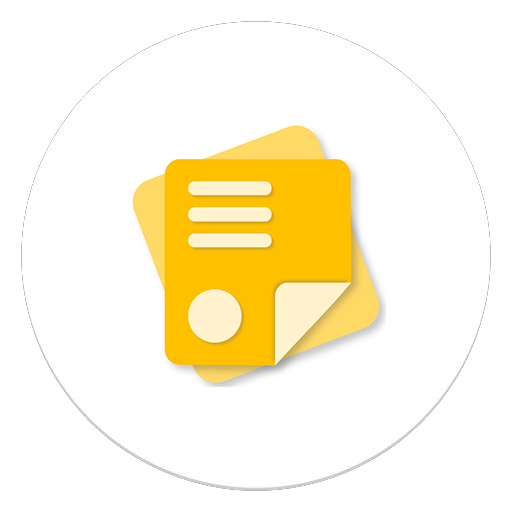
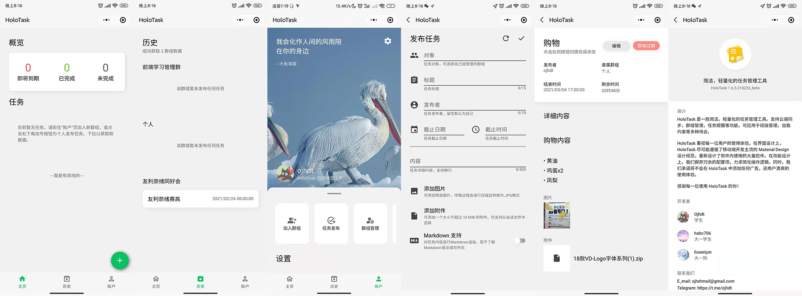
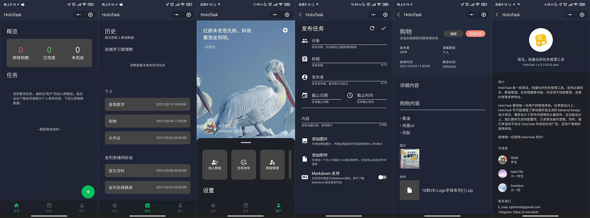

# HoloTask



简洁，轻量化的任务管理工具。


[](LICENSE)

HoloTask 是一款帮助用户管理日常事项的微信小程序（尚未上线）。支持云端同步，群组管理，任务提醒，完成情况统计功能。可应用于班级管理，自我约束等多种场合。

在界面设计上，HoloTask 重新设计了应用内使用的大量控件，尽可能遵循了移动端开发主流的 Material Design 设计规范。在功能设计上，HoloTask 摒弃冗余配置项，简化操作逻辑，追求清爽流畅的使用体验。

本开源项目用作交流学习。因存在个人主体小程序未开放的服务类目，本项目暂未上线。

[English Documentation](README.md)

## 目录

- [功能与特性](#功能与特性)
- [应用截图](#应用截图)
- [环境依赖](#环境依赖)
- [部署](#部署)
- [主要项目负责人](#主要项目负责人)
- [更新日志](#更新日志)
- [获取帮助](#获取帮助)
- [参与贡献方式](#参与贡献方式)
- [使用到的项目](#使用到的项目)
- [开源协议](#开源协议)

## 功能与特性

### 已实现

- 任务的发布，编辑，状态更改与删除
- 图片，附件的传输与在线预览
- 群组的创建，成员添加与管理
- Markdown 语法支持
- 数据统计
- 归档整理
- 完整的深色模式支持

### 待办

- 订阅消息
- 归档搜索

## 应用截图





## 环境依赖

- 基础库版本 >= 2.15.0

## 部署

本项目功能的实现依赖云开发环境，可能产生少量资费。

1. 前往[微信公众平台](https://mp.weixin.qq.com/)，完成新项目注册。进入`开发 > 开发管理 > 开发设置`获取AppID。

2. 进入`开发 > 云开发`，开通云开发环境，获取环境ID

3. 编辑 `project.config.json` ，填入APPID
```
"appid": "", //此处填入你的APPID
```

4. 使用微信开发者工具导入项目，编辑 `App.js` ，更改初始化项
```
wx.cloud.init({
  env: "" //此处填写你的云开发环境ID
})
```

5. 在云开发中分别新建空白集合 `data`，`user` 和 `group`，用于储存任务内容，用户信息和群组信息。并更改权限为**所有用户可读，仅创建者可读写**。

6. 在资源管理器中右键 `cloud` 文件夹，选择云开发环境，部署所有云函数。

7. Enjoy it~。

>非企业认证用户无法上线该项目，仅允许开发者个人开发或添加少数体验者体验。若尝试上线请与本人联系。

## 主要项目负责人

[@ojhdt](https://github.com/ojhdt/)

[@habc706](https://github.com/habc706)

[@liusenjun](https://github.com/liusenjun)

## 更新日志

### 1.6.5.210223_beta

- 加入分享入口
- 修复群组管理员显示错误

### 1.6.4.210222_beta

- 加入完成情况统计功能
- 修复无法搜索群组的错误
- 新增历史页登陆状态检测

### 1.6.0.210220_beta

- 支持附件上传
- 支持图片预览
- Markdown 语法支持

### 1.5.2.210219_beta

- 完善群组管理
- 新增账户页界面设置

## 获取帮助

尝试提交 GitHub issues 来阐述你的疑问和寻求解决方法: [Issues](https://github.com/ojhdt/HoloTask/issues)

你还可以通过以下方式联系开发者：

📧 电子邮箱 mailto:ojhdtmail@gmail.com

💬 电报 https://telegram.me/ojhdt

🗨️ 微信 ojhdtwechat

## 参与贡献方式

欢迎提交 PR。


## 使用到的项目

- [wemark](https://github.com/TooBug/wemark) - 微信小程序Markdown渲染库


## 开源协议

[MIT](LICENSE)
